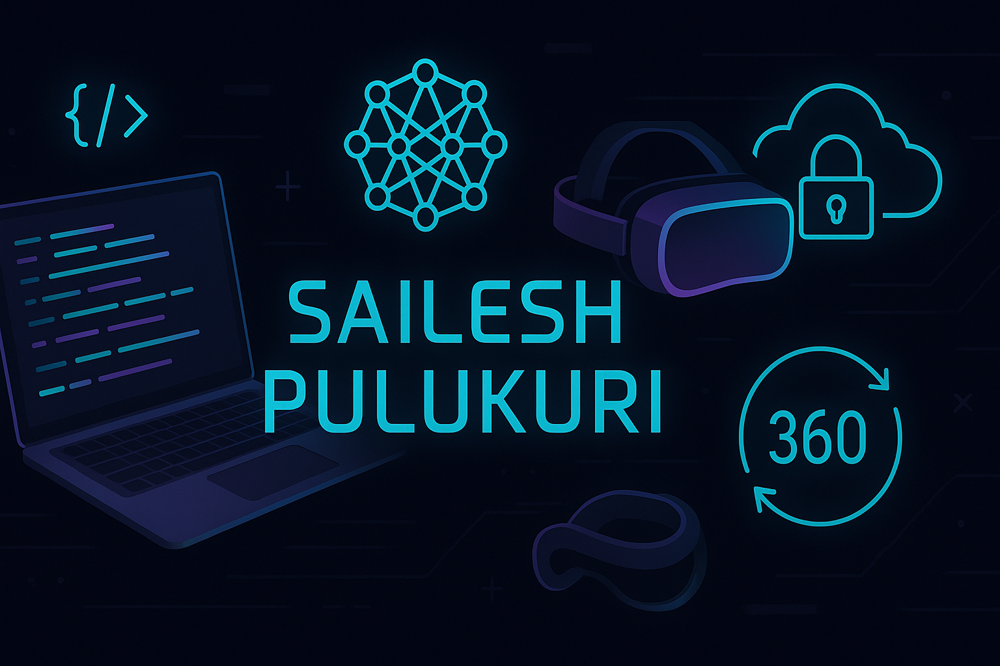

  

<h1 align="center">Hi 👋, I'm Sailesh Pulukuri</h1>

  <em>A Computer Science undergrad on a mission to blend <strong>Cybersecurity</strong>, <strong>AI/ML</strong>, and <strong>XR tech</strong> into meaningful digital experiences.</em>

---

### 💡 About Me

- 🧠 **Researcher @ SRM University**  
  Built secure cloud storage search models using Order-Revealing Encryption

- 👨‍💻 **Developer @ Edunet Internship**  
  Created an image steganography system in Python for secure messaging

- 🎮 **Indie Game Builder & Full-Stack Web Dev**  
  Built gaming and utility platforms using React, Firebase, and C++

- 🌐 Passionate about:  
  `Cybersecurity`, `Immersive Tech (AR/VR/360)`, `AI/ML`, `Creative Coding`, `Open Source`

---

### 🚀 Projects Spotlight

| 💻 Project                                     | 🔧 Tech Stack                      | 🔗 Links                                                                                            |
| ---------------------------------------------- | ---------------------------------- | --------------------------------------------------------------------------------------------------- |
| **Slicer** – Secure Search over Encrypted Data | Python, Cryptography, SORE         | —                                                                                                   |
| **Mental Health Prediction**                   | Python, scikit-learn, Google Colab | [Colab File](https://colab.research.google.com/drive/1HYnt_Iu_QaNGWsZTEJyTxicCmuPZ9pjl?usp=sharing) |
| **Pineapple Arcade**                           | React, Firebase, Bootstrap         | [Repo](https://github.com/Hemanth-Kolluru/Pineapple)                                                |
| **Homify Connect**                             | React, Bootstrap, JavaScript       | [Repo](https://github.com/donleaguesss/React-PG-Website)                                            |
| **C++ Console Games**                          | C++, Win32 API                     | —                                                                                                   |

---

### 🛠️ Tech Stack

  
  
  
  
  
  
  
  
  
  
  
  

---

### 📊 GitHub Stats

  

---

### 📫 Connect with Me

- 📧 [Email](mailto:saileshpulukuriofficial@gmail.com)
- 💼 [LinkedIn](https://www.linkedin.com/in/sailesh-pulukuri/)
- 🌐 [Portfolio Link](https://colab.research.google.com/drive/1HYnt_Iu_QaNGWsZTEJyTxicCmuPZ9pjl?usp=sharing)
- 📱 +91 9704874079

---

### ⚡ Fun Fact

> I once built a full VR experience in my local server... just because I wanted to see if I could.  
> **Spoiler:** I did. 😎

---

  <b>“Code with curiosity, build with purpose.”</b>

